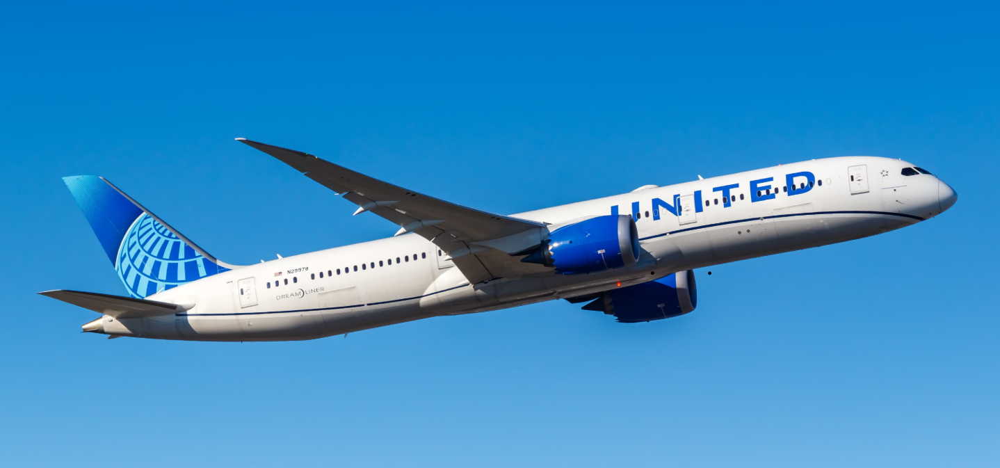

# Skytrax United Airlines Analysis

*Analyzed 4,500+ United Airlines reviews (2015–2025) with SQL, Python, and Mode Studio. Found that Business travelers are least satisfied, especially with value for money, while leisure travelers rate cabin staff and food higher. Seat comfort emerged as a universal weakness, and insights were used to guide improvement strategies.*

1. ## Overview